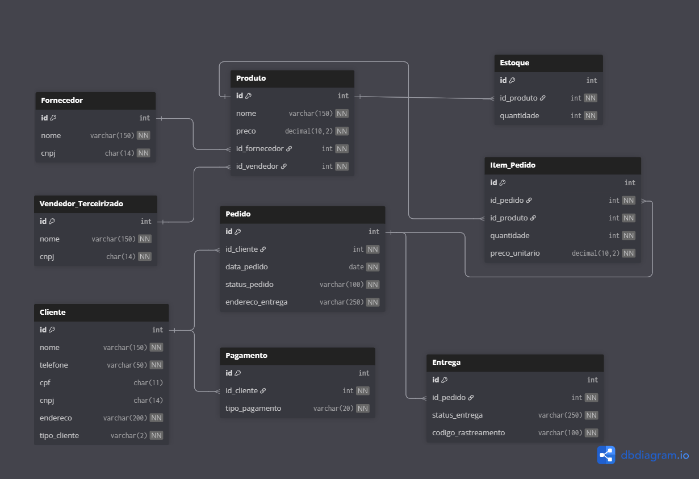

# E-commerce SQL Database

Projeto de modelagem e implementação de um banco de dados relacional para um sistema de e-commerce, com foco em entidades, relacionamentos, chaves primárias, chaves estrangeiras e consultas SQL.

## 📊 Modelo do Banco

## Estrutura do Projeto

- `sql/schema.sql` → criação das tabelas e relacionamentos
- `sql/inserts.sql` → inserção de dados para testes
- `sql/queries.sql` → consultas SQL do projeto
- `ecommerce-database-diagram.png` → diagrama do banco de dados

  ## Tecnologias Utilizadas

- SQL
- SQL Server
- Git
- GitHub
- dbdiagram.io

O banco simula um sistema de **e-commerce**, contendo:

- Cliente
- Produto
- Pedido
- Fornecedor
- Vendedor Terceirizado
- Estoque
- Pagamento
- Entrega

## 🛠 Tecnologias

- SQL Server
- SQL

## 📈 Consultas implementadas

- SELECT
- WHERE
- ORDER BY
- JOIN
- GROUP BY
- HAVING
- Atributos derivados
